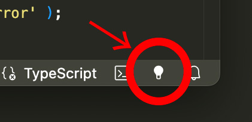

<a href="../README.md">English</a> / 日本語

# Open In Sourcetree Button

VSCode のステータスバー右側に Sourcetree を開くためのアイコンを追加する機能拡張です。

カレントファイルの属するワークスペースフォルダ、若しくは有効なワークスペースのフォルダを SourceTree で開きます。

コマンドパレットから `Open In SourceTree Button: open SourceTree` を選んでも開く事が出来ます。

## 必要環境

Sourcetree がインストールされている必要があります

## コンフィグ項目の説明

### * Soucetree Path (`openSourcetreeButton.SourcetreePath`):

空白時は以下の場所にある Sourcetree が使用されます。

- Windows（以下のいずれか）:
	- `C:\Program Files (x86)\Atlassian\SourceTree\SourceTree.exe`
	- `C:\Program Files\Atlassian\SourceTree\SourceTree.exe`
	- `<User-Home>\AppData\Local\SourceTree\SourceTree.exe`
- macOS: `Sourcetree.app`_(mac では通常フルパスである必要はありません)_

Sourcetree が別の場所にインストールされており起動できない場合、このコンフィグ項目で Sourcetree アプリケーションへのフルパスを指定して下さい。

コマンドパレットから `Open In SourceTree Button: SourceTree のパスをファイル選択ダイアログで設定する` を選んでファイル選択ダイアログから設定することも出来ます。

_注：セキュリティ上の理由によりファイル名は SourceTree.exe か Sourcetree.app でなければなりません。_

### * Icon (`openSourcetreeButton.icon`):

ステータスバー上のアイコン(Codeicon)を指定出来ます。指定出来るアイコン名は https://code.visualstudio.com/api/references/icons-in-labels#icon-listing を参照してください。

デフォルトでは Soucetree のアイコンに似ている `light-bulb` が設定されています。

### * Priority (`openSourcetreeButton.priority`):

ステータスバー上の並び順を決定するためのプライオリティー値です。

## ショートカットの設定方法

1. 「キーボードショートカット」( Win:`ctrl` + `k`,`ctrl` + `s` / mac:`cmd`+`k`,`cmd`+`s`)を開く
2. `tettekete.openSourcetreeButton` あるいは「Open In SourceTree Button: SourceTree で開く」を検索して選択する
3. キーバインドを設定する
