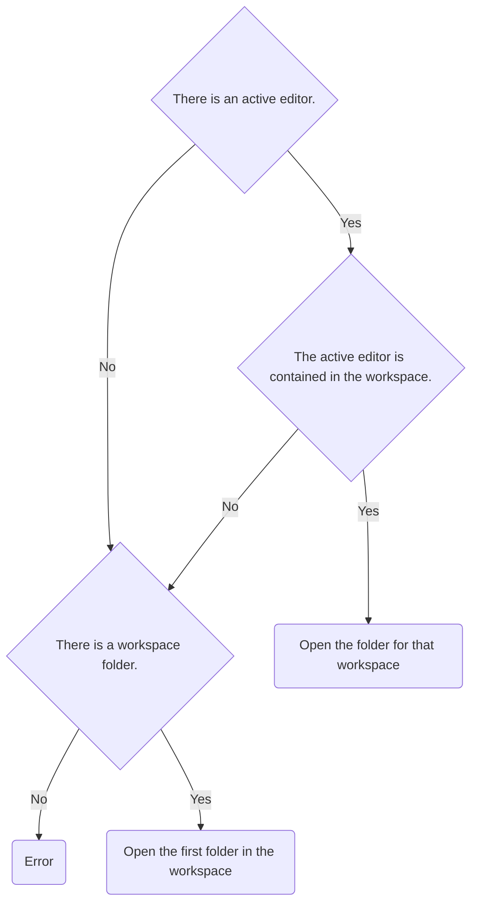
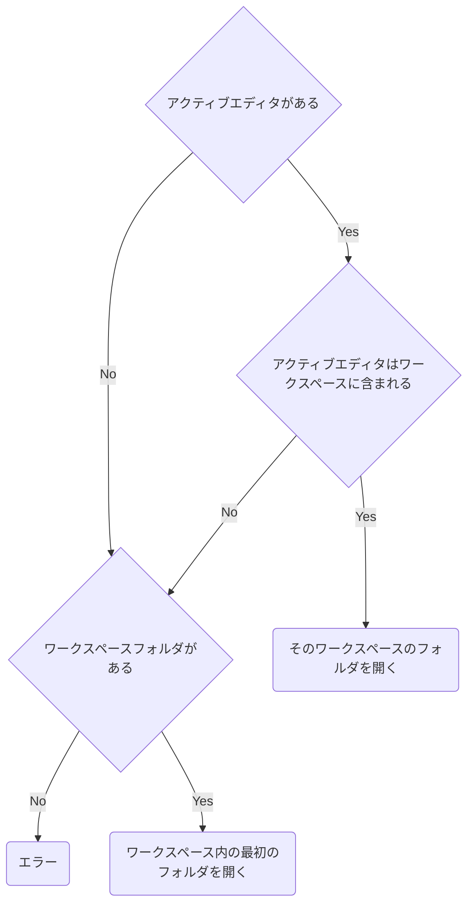

# Workflow for Selecting a Folder to Open

```mermaid
flowchart TD
	existsActiveEditor{"There is an active editor."} -->|Yes| isEditorInWorkspace{"The active editor is contained in the workspace."}
	existsActiveEditor -->|No| isExistsWorkspaceFolder{"There is a workspace folder."}
	isEditorInWorkspace -->|Yes| openInWorkspaceFolder("Open the folder for that workspace")
	isEditorInWorkspace -->|No| isExistsWorkspaceFolder
	isExistsWorkspaceFolder --> |No| error("Error")
	isExistsWorkspaceFolder --> |Yes| openFirstWSFolder("Open the first folder in the workspace")
```

## in Japanses

```mermaid
flowchart TD
	existsActiveEditor{"アクティブエディタがある"} -->|Yes| isEditorInWorkspace{"アクティブエディタはワークスペースに含まれる"}
	existsActiveEditor -->|No| isExistsWorkspaceFolder{"ワークスペースフォルダがある"}
	isEditorInWorkspace -->|Yes| openInWorkspaceFolder("そのワークスペースのフォルダを開く")
	isEditorInWorkspace -->|No| isExistsWorkspaceFolder
	isExistsWorkspaceFolder --> |No| error("エラー")
	isExistsWorkspaceFolder --> |Yes| openFirstWSFolder("ワークスペース内の最初のフォルダを開く")
```